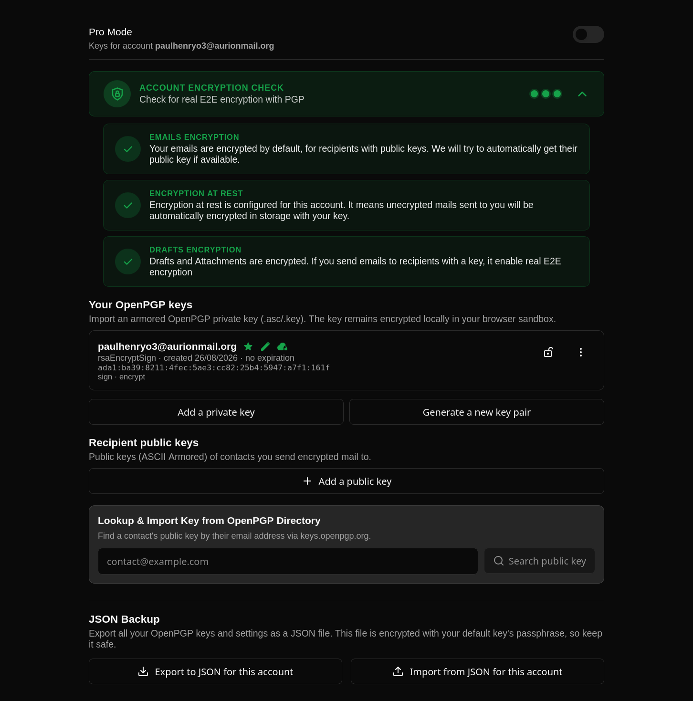

# PGP True E2E Plugin
> [!CAUTION]
> Migration to 2.0.0 : For users with > 1 accounts at same time: the index/preview will be reinitialized. You will have to re populate it by decrypting emails. More details about the migration here : https://github.com/paulhenry46/pgp-plugin/pull/17

End-to-end PGP for Bulwark Webmail. All cryptography runs locally in the browser.
## Screenshot

## Main Features

- **Core Cryptography** : Seamlessly encrypt, decrypt, sign, and verify emails locally using a modern OpenPGP engine. 
  - *Formats supported:* **PGP/MIME** (Read & Write) | **Inline-PGP** (Read-only, for legacy compatibility).
- **Zero-Disk Session Security (100% RAM)** : Unlike traditional plugins that temporarily write unlocked secret keys to shared browser storage (like IndexedDB), **PGP True E2E** isolates unlocked keys strictly within active plugin memory. Your decrypted keys never touch the disk, not even for a millisecond, ensuring instant destruction upon tab closure or browser crash.
- **True End-to-End Drafts & Attachments** : Standard PGP extensions only encrypt when you hit "Send", leaving your auto-saved drafts and attachments exposed to the mail server in cleartext while you write. This plugin intercepts the webmail's auto-save and upload cycles, encrypting drafts, attachments, and metadata (such as filename and MIME type) before they ever reach the network.
- **Encrypted-at-Rest Local Search Index** : **PGP True E2E** securely decrypts and indexes your emails into a local, encrypted-at-rest database. Search your secure history instantly without leaking a single keyword to the mail server or writing decrypted text to the disk.
- **Automated Key Exchange** : Automatically detects and imports public keys attached to incoming signed emails, making recipient keyring management effortless (optional).
- **Keyserver Integration** : Seamlessly publish your public key to or fetch recipient keys from `keys.openpgp.org` directly within the interface.
- **WebAuthn Passwordless Unlock** : Don't want to type your passphrase every time you open your webmail? Unlock your keys with a single click using WebAuthn/Passkeys (requires a hardware key/FIDO device supporting PRF).
- **Public Key Attachment** : One-click option to automatically attach your public key to outgoing emails.
- **Import / Export** : Easily backup and restore your local search/preview index and PGP keys (all accounts on your device or just per-accounts (2.0.0)).
- **Dynamic Recipient Badges:** Real-time check during drafting to see if `To/Cc/Bcc` addresses have valid public keys, displaying a visual badge next to them.
- **Smart Encryption Fallback:** If some recipients lack PGP keys, prompt the user before sending two separate emails with the same Message-ID (one encrypted to PGP-capable recipients, and one in cleartext to those without keys).
- **Generate yours keys** : You don't have keys ? You can generate them within the client ! Once generated, you will get a **revocation certificate** and a **emergency code** to unlock the key if you lost the passphrase.
- **Admin policies** : Decide what you want to your users : you can
  - enforce encryption : Force users to add/generate a key before they can send an email to a recipient. It ensure all users have a key.
  - enforce Drafts and attachments encryption whatever the users decided
  - block until users unlocked their default keys : that ensure users have their key unlocked. It automatically enable for user the  'Ask for default key on booting' option
  - allow persistent keys : Used to disabled the Dangerous Persistent Storage of keys. Disabling force users to type passphrase each time they connect to webmail but it is more secured.
- **Onboarding for new users** For new users which don't have key, there is an onboarding allowing them to generate keys and understand how PGP works.
- **Address Book Integration:** Native integration of public keys within the Bulwark contact/address book.
- **Encryption At Rest Stalwart Feature** : You can automatically publish your public key to Stalwart server to activate the Encryption At Rest.
### New in 2.0.0
- **Automatically decrypt when forwarding** Automatically decrypt when forwarding or replying (2.0.0)
- **Password change** : Change your keys password of your keys without losing your local index/preview (2.0.0)
- **Server vs. E2E Badges:** Display a dedicated message in banner to distinguish between E2E encrypted emails and those encrypted server-side (2.0.0).
- **Multi-accounts** : You can use the plugin with a lot of accounts. The keys used for each accounts are scoped by account. This way, you can share they to an account without sharing the all keys of your session (2.0.0). Before, it was possible to use it in multi-account, but it was not officaly supoorted and keys weren't scoped by accounts.
- **Web Key Directory** : When searching for keys, we now ask the Web Key Directory of domain before asking to `keys.openpgp.org`

For more details, refers to [DOCS.md](DOCS.md) file.

## Security & Threat Model

- **Privileged Tier:** The plugin declares `tier: "privileged"` + `crypto:full`. Per `resolvePluginTier`, the same-origin tier is only granted to a **signed, admin-approved (managed)** bundle after high-risk consent. Self-uploaded copies are refused (not downgraded):it must be signed and shipped through the admin channel.
- **Keys at Rest:** Private keys are re-wrapped with AES-256-GCM under an argon2id + generated salt (default) or PBKDF2 (SHA-256, 600,000 iterations, legacy) key derived from your custom passphrase. They are stored in IndexedDB; raw private key bytes are never persisted.
- **Keys in Use:** Unlocking a key stores it strictly in RAM. It is **never** persisted to IndexedDB or written to disk during the active session.
- **XSS & Isolation Limit:** The background part of the plugin acts like a service worker, communicating keys to other sandboxed components. 
  * *Note on Threat Model:* If an attacker successfully executes arbitrary JavaScript in the client (via XSS or a malicious third-party plugin), they could potentially intercept keys in memory. This is an inherent limitation of web-based cryptography. However, our 100% RAM isolation significantly reduces the attack surface compared to disk-bound alternatives that write active keys to browser storage.
- **Keys in Use:** with DangerousStorage activated : Stored encrypted with a non extractible AES key. It allows user to avoid decrypting when refreshing
- **Output Sanitization:** Returned HTML still passes through the host mail sanitizer before rendering.

## Local search index and keys Synchronisation
This currently not supported in this plugin, but you can use the fork made by [AurionMail](https://github.com/AurionMail/). It adds these features and many other !
## Build & Installation

```bash
npm install         
npm run package
```

## Dependencies
We use
- OpenPGP, of course
- mimetext to generate the mime message when encrypting
- hash-wasm for Argon2Id derivation

## License
This program is licensed under GPL-3.0-or-later.
## Thanks
This plugin is inspired by the official S/MIME plugin. Heartfelt thanks to its author, Linus Rath, for his invaluable work!
